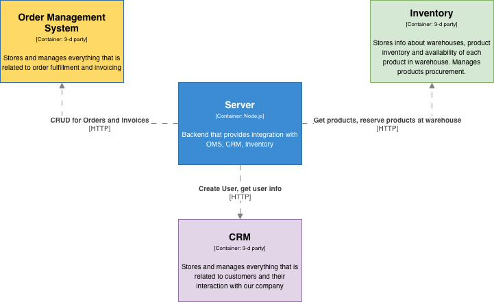

# Backend interview test
This repo was intentionally designed for the backend technical interview.
We ask candidates to perform a Code Review and highlight weak places, suggest changes and leave feedback
because it is what we do in everyday work.

p.s. Our production code looks way better :grin:

# Context

We are working in retail and distribution domain, so there are such entities as products, warehouses, customers, orders, invoices, some delivery and payment options.

This repo contains a server that provides integration with 3-rd party systems that are usual for our domain:
- `oms` - order management system
- `crm` - customer relation management system
- `inventory` - warehouse management system

## Development
- `nvm use`
- `npm i`
- `npm start`

:exclamation: All test credentials are stored in `config/default.js`

